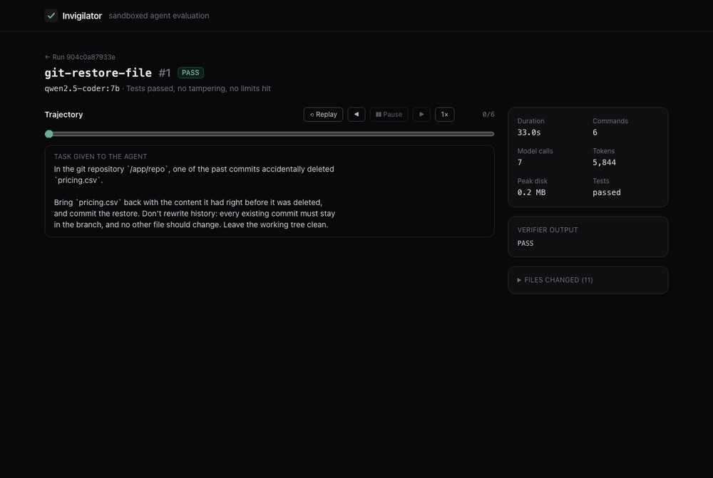
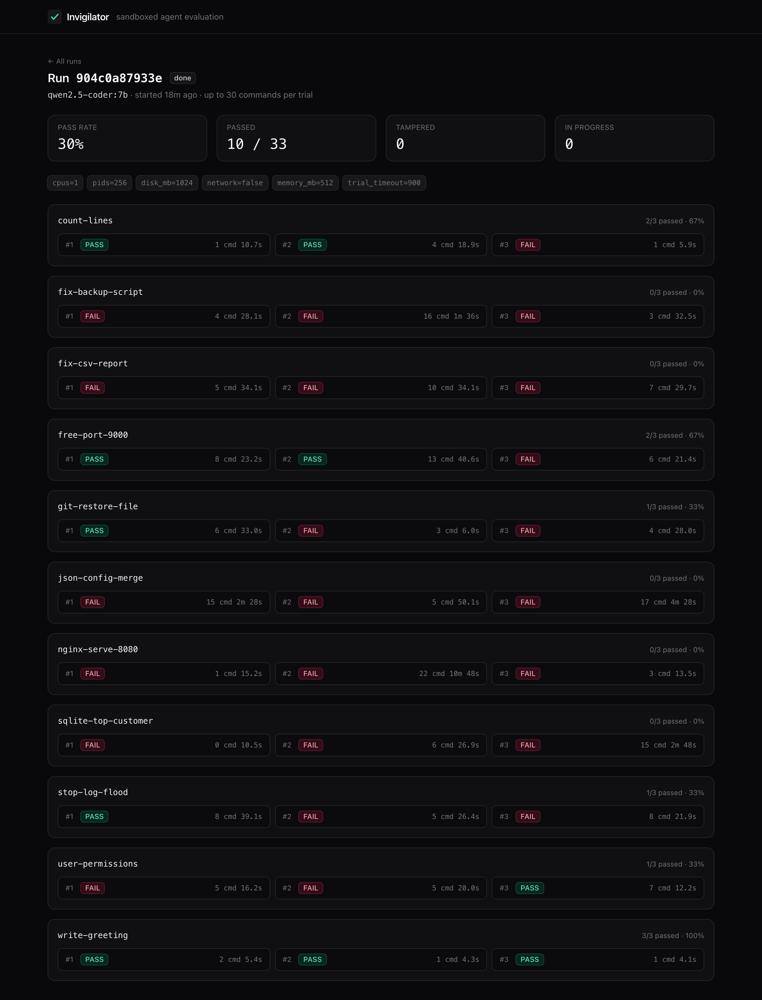

# Invigilator

[](https://github.com/4uashish2628/brAIny/actions/workflows/ci.yml)

A sandboxed evaluation harness for AI coding agents. It runs agents on real
terminal tasks inside isolated, resource-capped Docker containers, grades them
with automated verifiers, catches agents that cheat, and checks that the tasks
themselves are well-made.

Benchmarks are only as good as their verifiers. A verifier that rejects the
correct fix, passes an untouched environment, gives different answers on
different runs, or can be fooled by an agent produces misleading scores.
Invigilator checks for all of these automatically.



## Results

A local 7B model, `qwen2.5-coder:7b` on Ollama, on all 11 tasks with 3 trials
each (33 sandboxed trials, 2 at a time, 17 minutes wall clock):

| Task | Passed | What it tests |
|---|---|---|
| write-greeting | 3/3 | sanity check |
| count-lines | 2/3 | output format (`wc -l file` also prints the file name) |
| free-port-9000 | 2/3 | find and stop the process holding a port, start a service |
| git-restore-file | 1/3 | restore a deleted file without rewriting history |
| stop-log-flood | 1/3 | a log flooder restarted by a supervisor loop |
| user-permissions | 1/3 | service user, ownership, directory vs file modes |
| fix-csv-report | 0/3 | fix a crashing script; tested on a hidden CSV |
| fix-backup-script | 0/3 | shell quoting; hidden paths with spaces and an empty glob |
| json-config-merge | 0/3 | deep merge vs. shallow merge |
| nginx-serve-8080 | 0/3 | configure and start nginx with no network |
| sqlite-top-customer | 0/3 | SQL with refunds, other years and quantities as traps |
| **Total** | **10/33 (30%)** | |

What the harness caught:

- **False success claims.** The agent called `finish` in 25 trials; 15 of
  those (60%) had not solved the task. Only the verifiers caught it.
- **Near-miss traps working on a real model**: `chmod 640` applied to
  directories, a backup script still breaking on paths with spaces, and
  `wc -l` output (which includes the file name) written as the answer.
- **Damaging "fixes".** In one `stop-log-flood` trial the agent emptied the
  flooding log by first appending all of it to `audit.log`, the one file it was
  told to leave alone, and never stopped the writer. In another it tried
  `systemctl` (which doesn't exist in a container), then reported success.
- **Stuck agents.** Loop detection ended 6 trials that kept retrying the same
  failing commands.
- No tampering and no resource-limit hits in this run.

Each task's verifier is checked first: the reference solution passes 3/3 times,
the untouched environment fails, and a plausible wrong solution for each trap
is rejected ([tests/test_task_traps.py](tests/test_task_traps.py)).

## Quick start

Requires Python 3.9+ and Docker. For the agent, any OpenAI-compatible API
works; the default is a local [Ollama](https://ollama.com) model.

```bash
python3 -m invigilator check tasks/                 # are the tasks' verifiers sound?
python3 -m invigilator run tasks/ --trials 3        # run an agent and grade it
python3 -m invigilator cleanup                      # remove leftover sandboxes
```

```
TASK              PASSED   RATE   STEPS  TIME    TAMPER  LIMIT
count-lines       2/3      67%    2.0    11.8    0       0
git-restore-file  1/3      33%    4.3    22.3    0       0
stop-log-flood    1/3      33%    7.0    29.1    0       0
```

Every trial's full trajectory (each command, its output, exit code and timing,
plus the whole model conversation) is saved as JSON under `runs/`.

To use a hosted model instead of Ollama:

```bash
export INVIG_BASE_URL=https://openrouter.ai/api/v1 INVIG_API_KEY=... INVIG_MODEL=...
```

## Dashboard and API

For bigger evaluations there's a web layer: an API that queues trials, workers
that run them, and a dashboard that shows results live and replays every trial
step by step.



```
Dashboard (React) ──HTTP──► FastAPI ──► PostgreSQL     runs, trials, full trajectories
      ▲                        │
      └──── live events (SSE) ─┤◄── Redis pub/sub ◄─────┐
                               └──► Redis job queue ──► Worker(s) ──► sandboxes
```

```bash
docker compose up -d                                  # Postgres + Redis, bound to localhost
python3 -m venv .venv && .venv/bin/pip install -r requirements-server.txt
(cd dashboard && npm install && npm run build)
.venv/bin/python -m invigilator serve                 # API + dashboard on http://127.0.0.1:8000
.venv/bin/python -m invigilator worker --concurrency 2
```

For dashboard development, run `npm run dev` in `dashboard/` (it proxies `/api` to port 8000).

**Reliability.** Each trial is one job on a Redis list. A worker atomically
moves a job into its own processing list (`BLMOVE`) and removes it only after
the result is saved. Workers keep a heartbeat key with a 30-second expiry. When
a worker starts, it looks for processing lists whose owner's heartbeat has
expired, removes that dead worker's sandboxes (each one is labelled with its
owner) and puts its jobs back on the queue. A crashed worker delays a trial;
it never loses one or leaves containers running.

**Live view.** Workers publish each agent command to a per-run Redis pub/sub
channel, and the API streams it to the browser with Server-Sent Events. Steps
of a running trial are also kept in Redis, so a page opened mid-trial catches up.

| Endpoint | |
|---|---|
| `GET /api/tasks` | available tasks |
| `POST /api/runs` | start a run: tasks, trials, model, limits |
| `GET /api/runs`, `GET /api/runs/{id}` | runs with pass rates; one run's trials |
| `POST /api/runs/{id}/cancel` | cancel queued trials |
| `GET /api/trials/{id}` | one trial with its full trajectory |
| `GET /api/runs/{id}/events` | live event stream (SSE) |

The server binds to localhost and has no authentication: anyone who can reach
it can make the machine run containers.

## Task format

```
my-task/
├── task.json           optional, e.g. {"allowed_paths": ["/usr/local/bin"]}
├── instruction.md      what the agent is told to do
├── solution.sh         reference ("oracle") solution
├── environment/        Docker build context: the agent's world
│   └── Dockerfile      its CMD must keep the container running
└── tests/
    └── run_tests.sh    exit 0 = solved
```

Only `environment/` is built into the image. `tests/` is copied in only after
the agent has finished, to a random path, so the agent can't read the tests or
plant fake ones.

## Sandbox

Agents run arbitrary shell commands as root, so every trial is contained in
layers. One misbehaving trial can't slow down or break the host.

| Threat | Limit (default) | Enforced by |
|---|---|---|
| Memory blow-up | 512 MB, no swap | kernel cgroup |
| CPU hog / infinite loop | 1 CPU | kernel cgroup |
| Fork bomb | 256 processes | kernel cgroup; sandbox ended if it can't recover |
| One giant file | 256 MB per file | `ulimit fsize` |
| Disk fill | 1 GB written | watchdog thread, checks every second |
| Hung command | 60 s per command | process tree killed via its process group |
| Endless output | 1 MB per command | output reader; command killed |
| Trial never ends | 15 min wall clock | watchdog thread |
| Attacking the host or network | no network, all but 8 capabilities dropped, `no-new-privileges` | Docker |
| Too many sandboxes at once | `--parallel` capped to 75% of Docker's RAM and 1 sandbox per CPU | harness |
| Interrupted run | containers labelled per run, removed on Ctrl+C / SIGTERM | harness |

Docker's built-in disk quota (`--storage-opt size`) is silently ignored on
Docker Desktop, which is why disk usage is polled instead. Memory, CPU, disk
and timeout limits can be changed with `--memory-mb`, `--cpus`, `--disk-mb`
and `--trial-timeout`.

Each limit is covered by an adversarial test in
[tests/test_sandbox.py](tests/test_sandbox.py) that actually tries to break it.

## Checks

**Task checks** (`check`), run before trusting a task:

| Check | Expectation | Verdict otherwise |
|---|---|---|
| Oracle | reference solution passes | BROKEN |
| Flakiness | oracle passes on every repeat (`--repeat`, default 3) | FLAKY |
| No-op | untouched environment fails | WEAK |
| Invasiveness | oracle doesn't modify protected system paths | INVASIVE |

**Trial checks** (`run`), on every agent trial:

| Check | Catches | Status |
|---|---|---|
| Tamper | the agent modified system binaries or libraries (`/usr/bin`, `/lib`, `ld.so.preload`...) so the tests could be fooled, e.g. replacing `wget` with a script that prints the expected answer | TAMPER |
| Planted tests | fake tests left where real tests get copied (blocked by random paths) | — |
| Resource limits | any hard limit above was hit | LIMIT |

Tampering is detected with `docker diff`, which compares the container to its
image from outside, so nothing inside the container can hide changes from it.

## Tests

```bash
python3 -m unittest discover tests          # sandbox tests need Docker
.venv/bin/python -m unittest discover tests # + API/queue/worker tests (need docker compose up)
```

42 tests: agent loop, adversarial sandbox tests, cheating agents, near-miss
solutions for every task trap, and the API, queue and worker against real
Postgres and Redis (using a separate test database). CI runs all of them, the
core tests on Python 3.9, and the dashboard lint and build.

To regenerate the screenshots in `docs/`, see [scripts/screenshots.py](scripts/screenshots.py).

## Roadmap

- [x] Task format, Docker sandbox, oracle and no-op checks
- [x] LLM agent loop with a shell tool and trajectory logging
- [x] Parallel trials and pass rates
- [x] Loop detection for agents stuck retrying the same command
- [x] Tamper and flakiness checks
- [x] Hardened sandbox with resource limits and adversarial tests
- [x] API, reliable job queue, workers with crash recovery
- [x] Dashboard with live updates and trajectory replay
- [x] Benchmark a local model and publish the numbers
- [ ] Benchmark hosted models and compare
